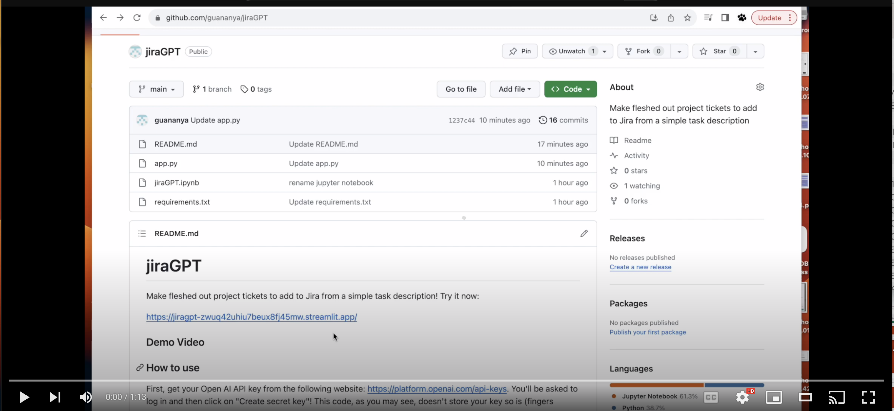

# jiraGPT
Make fleshed out project tickets to add to Jira from a simple task description! Try it now:

https://jiragpt-zwuq42uhiu7beux8fj45mw.streamlit.app/

### Demo Video

[](https://youtu.be/5DLDlpSO0VY)


### How to use
First, get your Open AI API key from the following website: https://platform.openai.com/api-keys. You'll be asked to log in and then click on "Create secret key"! This code, as you may see, doesn't store your key so is (fingers crossed) safe for you to input your API key into!


Once you have this, you can create fleshed out project tickets using simple task titles/descriptions by clicking "Generate Ticket" on the streamlit app!

Now, on how you can integrate this with Jira. First, ensure that you have an account on Jira. Once you have this, going to the 'projects' page, you should see something like below:


Here, make your first project by clicking "Create Project" on the top right corner of your screen. Then, click on "Software Development" and "Kanban Board" (this is what the current version of the project has been tried and tested on!). You'll eventually get to a page like this:


Once here, copy the 'KEY' variable- you can see this later too, but this will be your input to the 'Jira Project Name' on the streamlit app. You can also see this in your link (for example, https://ananya25.atlassian.net/jira/software/projects/TREEH/boards/2 has TREEH here). From this link, you also get the 'Jira Link' that needs to be inputted into the streamlit app- here it is https://ananya25.atlassian.net/, but yours will be with your 'company name' too! For your 'Jira Username', input in the email address you used while creating your Jira account. Now, go to https://id.atlassian.com/manage-profile/security/api-tokens to generate an API token which will go into your 'Jira API Key' field. 

Now, when you click 'Add to Jira', if everything goes well you'll be able to see the generated tickets directly in your Kanban board's issues!!! 

### Run locally

Download the app.py:

``` git clone git@github.com:guananya/jiraGPT.git```

Then, once in the project directory, install the requirements

``` pip install -r requirements.txt ```

Once this is done, run the app:

``` streamlit run app.py ```

### Jupyter Notebook
Change the variables in the first cell for the same variables mentioned in the 'How to use' section, following the same steps! 

### Future additions 
I'd want to make this more robust to error handling and explore efficiency. For example, for now, I add a slight lag to wait for the message to propogate through which may not be the best approach. I also want to add file support- it would be great to be able to upload, for example, a file of your code and have the model generate detailed ticket descriptions using that too. This added context could boost the quality of response significantly! Furthermore, I'd explore how to better format the output going into the Jira API call- right now it looks very raw, and I'd work more on refining that. 
